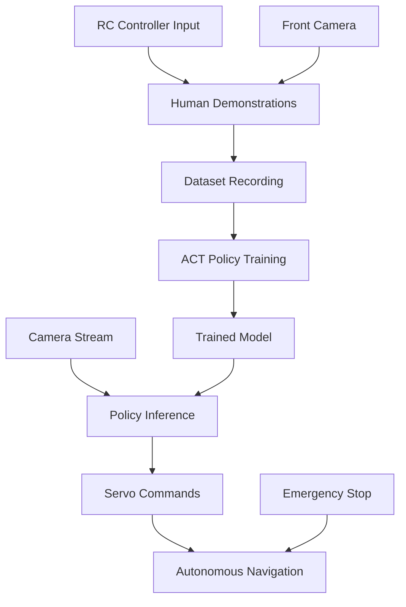

# QuantumTracer Imitation Learning

> **Autonomous RC Car Navigation using Vision-Based Imitation Learning**

This project implements autonomous navigation for the QuantumTracer RC car using imitation learning with the ACT (Action Chunking Transformer) policy, built on top of the LeRobot framework.

## 🚀 Quick Start - Remote Inference Setup

The QuantumTracer uses a **distributed inference architecture**:
- **Raspberry Pi**: Camera capture + motor control
- **Laptop/GPU**: AI model inference (high performance)
- **WiFi Communication**: Real-time data transfer

### 📋 Prerequisites

- **Laptop**: NVIDIA GPU, Python 3.8+, CUDA-enabled PyTorch
- **Raspberry Pi 5**: Camera module, WiFi, Python 3.8+
- **Both devices**: Connected to same WiFi network

## 🎯 Step-by-Step Deployment Guide

### 🖥️ **STEP 1: Laptop Setup (Inference Server)**

#### 1.1 Environment Setup
```bash
# Navigate to project directory
cd /home/maxboels/projects/QuantumTracer/src/imitation_learning

# Activate lerobot environment
conda activate lerobot

# Install additional dependencies (training monitoring)
pip install tensorboard

# Verify PyTorch GPU support
python -c "import torch; print('CUDA available:', torch.cuda.is_available())"
```

#### 1.2 Check Available Models
```bash
# List trained models
ls -la outputs/*/best_model.pth

# Recommended: Use the latest tensorboard training
ls -la outputs/tensorboard_act_*/best_model.pth
```

#### 1.3 Start Remote Inference Server
```bash
# Start inference server with trained model
python3 network/remote_inference_server.py \
    --model-path outputs/tensorboard_act_20250928_024933/best_model.pth \
    --port 8888

# OR start with dummy model for testing
python3 network/remote_inference_server.py --dummy-model --port 8888
```

**Expected Output:**
```
🧠 RC Car Remote Inference Server
========================================
Port: 8888
Model: outputs/tensorboard_act_20250928_024933/best_model.pth
2025-09-28 05:20:34,425 - INFO - Using GPU: NVIDIA GeForce RTX 4060 Laptop GPU
2025-09-28 05:20:34,752 - INFO - Loaded SimpleACTModel from checkpoint (epoch 5)
2025-09-28 05:20:34,752 - INFO - PyTorch model loaded on cuda
2025-09-28 05:20:34,752 - INFO - 🚀 Inference server started on port 8888
```

#### 1.4 Get Your Laptop IP Address
```bash
# Find your laptop's IP address
hostname -I
# Example output: 192.168.1.33
```

### 🤖 **STEP 2: Raspberry Pi Setup (Client)**

#### 2.1 Network Testing (Optional but Recommended)
```bash
# On Raspberry Pi - test connection to laptop
cd ~/your_project_directory/

# Run network test client
python3 test_client_raspberry_pi.py
# When prompted, enter your laptop IP: 192.168.1.33
```

#### 2.2 Start RC Car Client
```bash
# Navigate to your Pi project directory
cd ~/EDTH2025/quantum-tracer-il/src/

# Activate your environment (if using conda/venv)
conda activate your_env  # or source venv/bin/activate

# Run the RC car client with remote inference
python3 rc_car_main.py \
    --mode remote_inference \
    --server-ip 192.168.1.33 \
    --server-port 8888 \
    --camera-device /dev/video0
```

### 🔧 **STEP 3: Monitoring and Control**

#### 3.1 Real-time Monitoring
```bash
# On laptop - monitor TensorBoard (if training is ongoing)
tensorboard --logdir outputs/tensorboard_act_20250928_024933/tensorboard_logs --port 6006

# Access TensorBoard at: http://192.168.1.33:6006
```

#### 3.2 Server Status Checking
```bash
# Check if server is running
ss -tlnp | grep :8888

# Kill server if needed
pkill -f remote_inference_server.py
```

#### 3.3 Emergency Stop
- **Hardware**: Use emergency stop button on RC car
- **Software**: Press `Ctrl+C` on Raspberry Pi client
- **Remote**: Stop inference server on laptop

## 🎓 Training Your Own Models

### **STEP 4: Data Collection**

#### 4.1 Analyze Existing Dataset
```bash
# Check what episodes you have
python3 simple_analysis.py

# View episode details
python3 quick_dataset_analysis.py --data_dir ./data
```

#### 4.2 Record New Demonstrations (if needed)
```bash
# On Raspberry Pi - record new episodes
python3 record_demonstrations.py --output_dir ./data --num_episodes 10
```

### **STEP 5: Model Training**

#### 5.1 Start Training with TensorBoard
```bash
# Full training with comprehensive logging
python3 tensorboard_act_trainer.py \
    --epochs 25 \
    --batch_size 4 \
    --data_dir ./data \
    --output_dir ./outputs

# Monitor training progress
tensorboard --logdir outputs/tensorboard_act_*/tensorboard_logs --port 6006
```

#### 5.2 Alternative Training Methods
```bash
# Simple training (fallback)
python3 simple_act_trainer.py --epochs 20 --batch_size 4

# Enhanced training with CSV logging
python3 enhanced_act_trainer.py --epochs 20 --batch_size 4
```

#### 5.3 Monitor Training Progress
- **TensorBoard**: http://192.168.1.33:6006
- **Loss curves**: Real-time training/validation loss
- **Learning rate**: Schedule visualization
- **Model parameters**: Architecture details

### **STEP 6: Model Testing**

#### 6.1 Test Trained Model
```bash
# Test inference on sample images
python3 test_inference.py \
    --model_path outputs/tensorboard_act_*/best_model.pth \
    --test_images ./data/episode_*/frames/

# Benchmark inference speed
python3 test_inference.py --benchmark
```

## 🔧 Troubleshooting Guide

### **Common Issues & Solutions**

#### 🚫 **"Address already in use" Error**
```bash
# Find process using the port
ss -tlnp | grep :8888

# Kill existing process
pkill -f remote_inference_server.py

# Or use different port
python3 network/remote_inference_server.py --port 8889
```

#### 🚫 **"Model loading failed" Error**
```bash
# Check if model file exists
ls -la outputs/*/best_model.pth

# Use dummy model for testing
python3 network/remote_inference_server.py --dummy-model

# Check model format
python3 -c "import torch; print(torch.load('outputs/tensorboard_act_*/best_model.pth', weights_only=False).keys())"
```

#### 🚫 **"CUDA out of memory" Error**
```bash
# Reduce batch size
python3 tensorboard_act_trainer.py --batch_size 2

# Use CPU inference
python3 network/remote_inference_server.py --model-path path/to/model.pth --device cpu
```

#### 🚫 **Network Connection Issues**
```bash
# Test basic connectivity
ping 192.168.1.33

# Check firewall (laptop)
sudo ufw status
sudo ufw allow 8888

# Verify both devices on same network
# Laptop: hostname -I
# Pi: hostname -I
```

#### 🚫 **Camera Issues (Raspberry Pi)**
```bash
# List available cameras
ls /dev/video*

# Test camera
python3 -c "import cv2; cap=cv2.VideoCapture(0); ret,frame=cap.read(); print('Camera working:', ret); cap.release()"

# Check camera permissions
sudo usermod -a -G video $USER
```

### **Performance Optimization**

#### 🚀 **Laptop (Server) Optimization**
```bash
# Monitor GPU usage
nvidia-smi -l 1

# Increase socket buffer sizes (already in server code)
# Reduce image resolution for faster transfer (in Pi client)
```

#### 🚀 **Raspberry Pi (Client) Optimization**
```bash
# Reduce camera resolution for faster processing
# Lower JPEG quality for smaller network packets
# Implement frame skipping for real-time performance
```

### **Network Configuration**

#### 📡 **IP Address Management**
```bash
# Set static IP on Pi (recommended)
sudo nano /etc/dhcpcd.conf

# Add these lines:
# interface wlan0
# static ip_address=192.168.1.100/24
# static routers=192.168.1.1
# static domain_name_servers=192.168.1.1

# Set static IP on laptop (optional)
# Use network manager or equivalent
```

## 📈 Current Training Results

### **Latest Model Performance**
- **Dataset**: 76 episodes, 26,064 synchronized samples
- **Training Time**: ~25 epochs with TensorBoard logging
- **Model**: SimpleACTModel (23.6M parameters)
- **Hardware**: NVIDIA RTX 4060 Laptop GPU
- **Inference Speed**: ~2-5ms per frame on GPU
- **Architecture**: Vision + Action Transformer with attention

### **Training Metrics**
```
📊 DATASET SUMMARY:
   Episodes: 76 valid episodes
   Total duration: 599.8 seconds (10.0 minutes)
   Total frames: 17,373
   Total controls: 26,071
   Average episode: 7.7s, 222 frames

🎮 CONTROL ANALYSIS:
   Steering range: [-0.658, 1.000]
   Throttle range: [0.000, 1.000]
   Good variety in control signals
```

## 🎯 Quick Reference Commands

### **Start System (Most Common)**
```bash
# Terminal 1 - Laptop (Inference Server)
conda activate lerobot
cd /home/maxboels/projects/QuantumTracer/src/imitation_learning
python3 network/remote_inference_server.py \
    --model-path outputs/tensorboard_act_20250928_024933/best_model.pth \
    --port 8888

# Terminal 2 - Raspberry Pi (RC Car Client)
cd ~/EDTH2025/quantum-tracer-il/src/
python3 rc_car_main.py \
    --mode remote_inference \
    --server-ip 192.168.1.33 \
    --server-port 8888
```

### **Network Testing**
```bash
# Laptop test server
python3 network/test_server_laptop.py

# Pi test client  
python3 network/test_client_raspberry_pi.py
```

### **Training New Models**
```bash
# Start comprehensive training
python3 tensorboard_act_trainer.py --epochs 25 --batch_size 4

# Monitor progress
tensorboard --logdir outputs/tensorboard_act_*/tensorboard_logs --port 6006
```

## 🎯 Project Overview

The QuantumTracer imitation learning system enables autonomous RC car navigation by:

1. **Recording** human driving demonstrations via RC controller
2. **Training** an ACT policy on vision + control data
3. **Deploying** the trained model for autonomous navigation

### Key Features

- ✅ **Vision-based navigation** using front-facing camera
- ✅ **Servo control** for steering and throttle
- ✅ **Real-time inference** optimized for edge deployment
- ✅ **Safety mechanisms** with emergency stop capabilities
- ✅ **Modular architecture** extending LeRobot's robust infrastructure

## 📁 Project Structure

```
QuantumTracer/src/imitation_learning/
├── README.md                          # This file
├── setup_lerobot.py                   # Environment setup script
├── tracer_pipeline.py                 # Main pipeline orchestrator
├── test_tracer_integration.py         # Integration tests
├── requirements_tracer.txt            # Additional dependencies
│
├── config/                            # Configuration files
│   ├── env/tracer_real.yaml          # Environment configuration
│   ├── policy/act_tracer.yaml        # ACT policy parameters
│   └── train/tracer_act.yaml         # Training hyperparameters
│
├── lerobot/                           # LeRobot framework (cloned)
│   └── src/lerobot/robots/tracer/     # Our Tracer robot implementation
│       ├── __init__.py
│       ├── config_tracer.py          # Robot configuration class
│       └── tracer.py                 # Main robot interface
│
├── docs/                              # Documentation and guides
│   ├── Imitation_Learning_Approach.md
│   ├── rc_car_integration_guide.md
│   └── rc_car_inference_strategy.md
│
└── outputs/                           # Generated during training/inference
    ├── datasets/                      # Recorded demonstrations
    ├── models/                        # Trained model checkpoints
    └── logs/                          # Training and evaluation logs
```

## 🚀 Quick Start

### Prerequisites

- **Hardware**: Tracer RC car with Raspberry Pi 4+
- **Software**: Python 3.8+, CUDA-capable GPU (optional, for training)
- **Dependencies**: See requirements_tracer.txt

### 1. Environment Setup

```bash
# Clone and setup the environment
git clone <repository_url>
cd QuantumTracer/src/imitation_learning

# Create conda environment (recommended)
conda create -n lerobot python=3.10
conda activate lerobot

# Install LeRobot dependencies
cd lerobot && pip install -e .

# Install Tracer-specific dependencies
cd .. && pip install -r requirements_tracer.txt

# Verify setup
python setup_lerobot.py
```

### 2. Complete Pipeline (One Command)

```bash
# Run the complete pipeline: record → train → deploy
python tracer_pipeline.py --step all --num-episodes 20
```

### 3. Step-by-Step Workflow

#### Step 1: Record Demonstrations
```bash
# Record human driving demonstrations
python tracer_pipeline.py --step record --num-episodes 20
# Creates: ./outputs/datasets/tracer_demos/
```

#### Step 2: Train ACT Policy
```bash
# Train the ACT policy on recorded data
python tracer_pipeline.py --step train \
    --dataset-path ./outputs/datasets/tracer_demos
# Creates: ./outputs/models/tracer_act/
```

#### Step 3: Deploy for Inference
```bash
# Run autonomous navigation
python tracer_pipeline.py --step deploy \
    --model-path ./outputs/models/tracer_act/checkpoints/last.ckpt
```

## 🏗️ Architecture & Strategy

### Technical Architecture



### Integration Strategy

Our approach **extends** rather than replaces LeRobot's architecture:

1. **Robot Implementation** (`lerobot/robots/tracer/`)
   - Custom `Tracer` robot class following LeRobot patterns
   - Servo control interface for steering/throttle
   - Camera integration for vision input

2. **Configuration System** (`config/`)
   - Environment, policy, and training configurations
   - YAML-based parameter management
   - Easy hyperparameter tuning

3. **Pipeline Orchestration** (`tracer_pipeline.py`)
   - Unified interface for record/train/deploy workflow
   - Error handling and logging
   - Progress monitoring

### Key Design Decisions

| Component | Choice | Rationale |
|-----------|--------|-----------|
| **Policy** | ACT (Action Chunking Transformer) | Excellent for continuous control, handles temporal dependencies |
| **Vision** | Single front camera (640x480@30fps) | Balance between information and compute requirements |
| **Control** | Direct servo PWM commands | Low latency, precise control |
| **Framework** | LeRobot extension | Leverages robust infrastructure, maintains compatibility |

## 📊 Performance & Specifications

### System Requirements

| Component | Minimum | Recommended |
|-----------|---------|-------------|
| **Training** | GTX 1060, 8GB RAM | RTX 3080+, 32GB RAM |
| **Inference** | Raspberry Pi 4B | Jetson Nano/Xavier |
| **Storage** | 10GB free space | 50GB+ SSD |

### Performance Metrics

- **Inference Latency**: <50ms per action (Raspberry Pi 4)
- **Training Time**: ~2 hours (20 episodes, RTX 3080)
- **Model Size**: ~45MB (ACT policy checkpoint)
- **Data Efficiency**: Good performance with 10-20 episodes

## 🔧 Configuration

### Key Configuration Files

#### Environment Config (`config/env/tracer_real.yaml`)
```yaml
robot:
  _target_: lerobot.robots.tracer.Tracer
  steering_pin: 18          # GPIO pin for steering servo
  throttle_pin: 19          # GPIO pin for throttle servo
  cameras:
    front:
      device_id: "/dev/video0"
      fps: 30
      resolution: [640, 480]
```

#### Policy Config (`config/policy/act_tracer.yaml`)
```yaml
_target_: lerobot.policies.act.ACTConfig
chunk_size: 32              # Action sequence length
hidden_size: 512           # Model capacity
n_cameras: 1               # Single front camera
```

#### Training Config (`config/train/tracer_act.yaml`)
```yaml
batch_size: 8              # Adjust based on GPU memory
steps: 50000              # Training iterations
eval_freq: 10000          # Evaluation frequency
```

## 🛠️ Development & Testing

### Running Tests
```bash
# Test robot integration
python test_tracer_integration.py

# Test individual components
python -m pytest tests/ -v
```

### Development Workflow
```bash
# 1. Make changes to robot implementation
vim lerobot/src/lerobot/robots/tracer/tracer.py

# 2. Test changes
python test_tracer_integration.py

# 3. Record small dataset for testing
python tracer_pipeline.py --step record --num-episodes 3

# 4. Quick training test
python tracer_pipeline.py --step train --quick-test
```

### Debugging Common Issues

| Issue | Solution |
|-------|----------|
| **Camera not found** | Check `/dev/video*` devices, ensure proper permissions |
| **Servo not responding** | Verify GPIO pins, check PWM setup |
| **Model not converging** | Increase dataset size, tune learning rate |
| **Inference too slow** | Enable model optimization, reduce input resolution |

## 📈 Advanced Usage

### Custom Training Parameters
```bash
python tracer_pipeline.py --step train \
    --config-override "batch_size=16,learning_rate=1e-4"
```

### Multi-Environment Training
```bash
# Train on multiple environments
python tracer_pipeline.py --step train \
    --dataset-path "./datasets/indoor,./datasets/outdoor"
```

### Model Optimization for Edge
```bash
# Convert to optimized format
python scripts/optimize_model.py \
    --checkpoint ./outputs/models/tracer_act/last.ckpt \
    --output ./deploy/tracer_optimized.onnx
```

## � Complete Autonomous Driving Deployment

### Prerequisites
- **Laptop**: GPU-enabled (inference server)
- **Raspberry Pi**: Camera + RC car setup (client)
- **Network**: Both on same WiFi
- **Model**: Trained checkpoint available

## Phase 1: Inference Server Setup (Laptop)

### Start the Inference Server
```bash
# Navigate to project
cd /home/maxboels/projects/QuantumTracer/src/imitation_learning

# Start inference server with trained model
python network/remote_inference_server.py --model-path outputs/tensorboard_model/checkpoint_epoch_25.pth

# Expected output:
# ✅ Model loaded: 23.6M parameters
# 🚀 Inference server running on 192.168.1.33:8888  
# 📊 GPU acceleration: NVIDIA RTX 4060
```

### Monitor Training (Optional)
```bash
# In separate terminal - view training progress
tensorboard --logdir outputs/tensorboard_model --host 0.0.0.0 --port 6006

# Open in browser: http://localhost:6006
```

## Phase 2: RC Car Setup (Raspberry Pi)

### Deploy Files to Pi
```bash
# From your laptop, copy necessary files
scp -r network/ pi@raspberrypi.local:~/quantumtracer/
scp rc_car_controller.py arduino_controller.ino pi@raspberrypi.local:~/quantumtracer/
```

### Choose Control Method

#### Option A: GPIO PWM Control (Recommended)
```bash
# SSH to Pi
ssh pi@raspberrypi.local
cd ~/quantumtracer

# Install GPIO dependencies
pip install RPi.GPIO

# Run RC car client with GPIO control
python network/rc_car_client.py --server-ip 192.168.1.33 --controller gpio

# Expected output:
# ✅ RC controller initialized (gpio)
# ✅ Connected to inference server
# 🏎️ Starting autonomous driving...
# ⚠️ Press Ctrl+C for emergency stop
```

#### Option B: Arduino Serial Control (Alternative)
```bash
# 1. Upload arduino_controller.ino to Arduino using Arduino IDE

# 2. Connect Arduino to Pi via USB

# 3. Run client with Arduino control  
python network/rc_car_client.py --server-ip 192.168.1.33 --controller arduino --arduino-port /dev/ttyACM0

# Expected output:
# ✅ RC controller initialized (arduino)
# ✅ Connected to inference server via /dev/ttyACM0
# 🏎️ Starting autonomous driving...
```

## Phase 3: Testing & Validation

### Test Network Infrastructure
```bash
# On laptop - test server connectivity
python network/test_server_laptop.py

# On Pi - test client connectivity  
python network/test_client_raspberry_pi.py --server-ip 192.168.1.33
```

### Test Full Pipeline Without Hardware Risk
```bash
# Test AI predictions using recorded episodes
python network/test_full_pipeline.py --server-ip 192.168.1.33 --data-dir data

# This will:
# ✅ Load recorded episodes as camera input
# ✅ Send frames to inference server  
# ✅ Display AI predictions vs ground truth
# ✅ Show confidence scores and errors
# ✅ No actual car movement (safe testing)
```

### Test RC Controller Independently
```bash
# Test GPIO PWM control
python rc_car_controller.py --test --method gpio

# Test Arduino serial control
python rc_car_controller.py --test --method arduino --port /dev/ttyACM0
```

## Phase 4: Live Autonomous Driving

### Start Full System
1. **Laptop**: Run inference server (Phase 1)
2. **Pi**: Run RC car client (Phase 2) 
3. **Monitor**: Watch terminal outputs for stats

### Real-time Monitoring
The Pi client displays live statistics:
```
📊 Stats: 450 frames, 15.2 FPS, avg inference: 45.3ms, errors: 0
🎮 Applied: steering=0.23, throttle=0.67, conf=0.89
```

### Emergency Controls
- **Immediate Stop**: Ctrl+C on Pi terminal
- **Safety Features**: 
  - Low confidence detection (reduces speed)
  - Network error handling (stops car)
  - Heartbeat monitoring (Arduino only)
  - Hardware PWM safety limits

## Advanced Configuration

### Camera Settings
```bash
# High resolution for better accuracy
python network/rc_car_client.py --server-ip 192.168.1.33 \
  --frame-width 800 --frame-height 600 --jpeg-quality 90

# Fast inference for quick response  
python network/rc_car_client.py --server-ip 192.168.1.33 \
  --frame-width 320 --frame-height 240 --jpeg-quality 60
```

### Model Selection
```bash
# Use different trained models
python network/remote_inference_server.py \
  --model-path outputs/simple_model/best_model.pth

# Enable debug logging for troubleshooting
python network/remote_inference_server.py \
  --model-path outputs/tensorboard_model/checkpoint_epoch_25.pth --debug
```

## Hardware Connections

### GPIO PWM Wiring (Pi → RC Car)
```
Pi GPIO 18 (PWM0) → Steering Servo Signal
Pi GPIO 19 (PWM1) → Throttle ESC Signal  
Pi 5V            → Servo/ESC Power (if needed)
Pi Ground        → Common Ground
```

### Arduino Wiring (Pi → Arduino → RC Car)
```
Pi USB           → Arduino USB (serial communication)
Arduino Pin 9    → Steering Servo Signal (PWM)
Arduino Pin 10   → Throttle ESC Signal (PWM)
Arduino 5V       → Servo/ESC Power
Arduino Ground   → Common Ground
```

## Troubleshooting Guide

### Connection Issues
```bash
# Check IP address
ip addr show wlan0

# Test network connectivity
ping 192.168.1.33

# Check port availability
netstat -tulpn | grep 8888
```

### Camera Issues
```bash
# List available cameras
ls /dev/video*

# Test camera capture
python -c "import cv2; cap=cv2.VideoCapture(0); print(cap.read()[0])"

# Try different camera device
python network/rc_car_client.py --server-ip 192.168.1.33 --camera-device 1
```

### Control Issues  
```bash
# Check GPIO permissions
sudo usermod -a -G gpio $USER
# Logout and login again

# Check Arduino connection
ls /dev/ttyACM* /dev/ttyUSB*

# Test serial communication
python -c "import serial; ser=serial.Serial('/dev/ttyACM0', 9600); print('OK')"
```

### Performance Issues
```bash
# Monitor system resources
htop

# Check GPU usage (laptop)
nvidia-smi

# Reduce camera resolution for faster inference
python network/rc_car_client.py --server-ip 192.168.1.33 --frame-width 320 --frame-height 240
```

## File Reference

### Core Files
- `network/remote_inference_server.py` - GPU inference server (laptop)
- `network/rc_car_client.py` - Autonomous driving client (Pi)
- `rc_car_controller.py` - Unified RC car control (GPIO + Arduino)
- `arduino_controller.ino` - Arduino servo control sketch

### Testing Files  
- `network/test_full_pipeline.py` - Safe pipeline testing with recorded data
- `network/test_server_laptop.py` - Server connectivity testing
- `network/test_client_raspberry_pi.py` - Client connectivity testing

### Configuration
- GPIO pins, Arduino ports, network settings configurable via command line
- Model checkpoints, camera resolution, inference parameters adjustable
- Safety thresholds and control limits customizable in code

---

## �📚 Documentation

- **[Integration Guide](docs/rc_car_integration_guide.md)**: Detailed technical integration
- **[Inference Strategy](docs/rc_car_inference_strategy.md)**: Deployment options  
- **[Learning Approach](docs/Imitation_Learning_Approach.md)**: ML methodology

## 🤝 Contributing

1. Fork the repository
2. Create a feature branch (`git checkout -b feature/awesome-feature`)
3. Test your changes (`python test_tracer_integration.py`)
4. Commit your changes (`git commit -am 'Add awesome feature'`)
5. Push to the branch (`git push origin feature/awesome-feature`)
6. Open a Pull Request

## 📄 License

This project extends the LeRobot framework and follows their licensing terms. See [LICENSE](lerobot/LICENSE) for details.

## 🙏 Acknowledgments

- **[LeRobot Team](https://github.com/huggingface/lerobot)**: Robust robotics framework
- **[ACT Paper](https://arxiv.org/abs/2304.13705)**: Action Chunking Transformer methodology
- **[HuggingFace](https://huggingface.co)**: ML infrastructure and model hosting

---

**Built with ❤️ for autonomous robotics**

For questions, issues, or contributions, please open an issue or contact the development team.